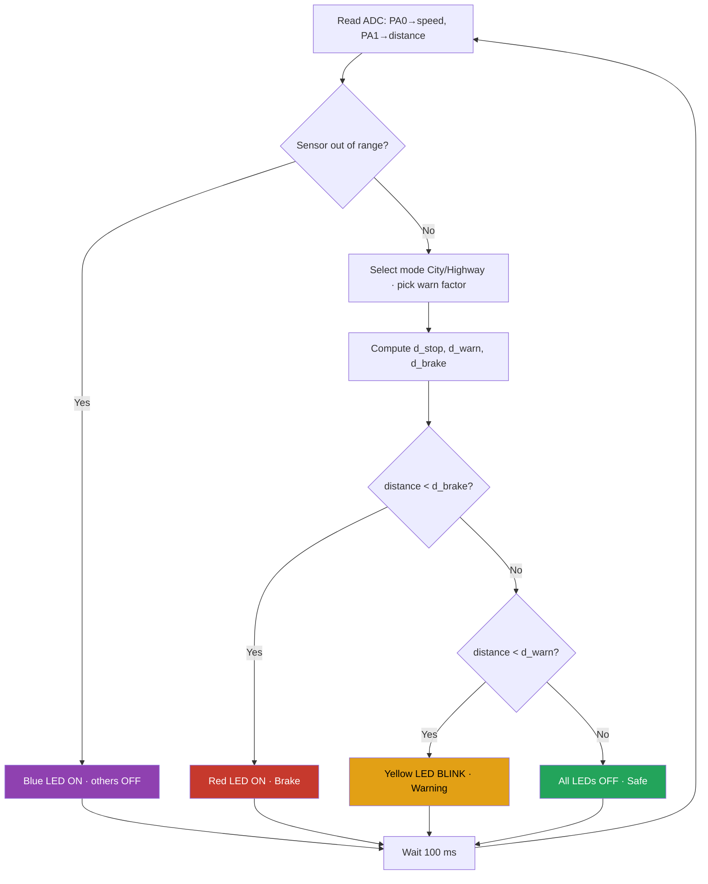
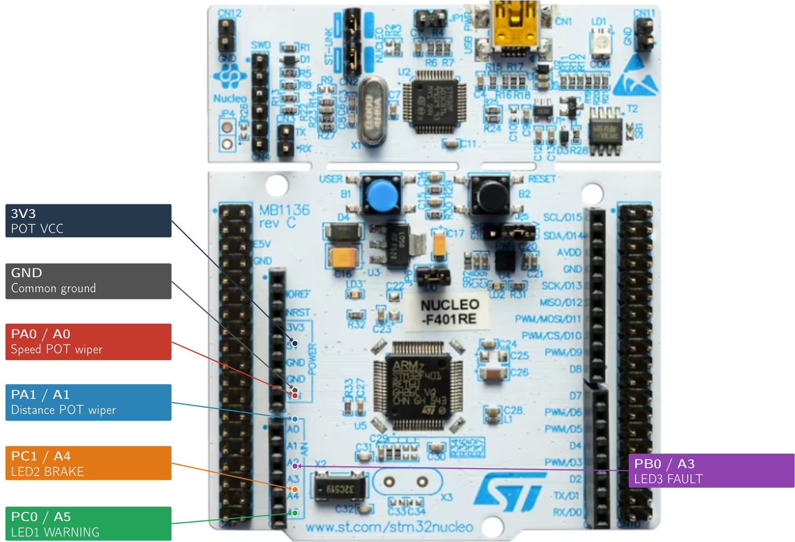

# Driver Assistance System — Obstacle Warning & Brake Alert

An embedded **driver-assistance** prototype on the **STM32 Nucleo-F411RE**. It continuously
reads the car's **speed** and the **distance to an obstacle**, computes a physics-based safe
stopping distance, and drives three LEDs to warn the driver:

| State | Meaning | Indicator |
|-------|---------|-----------|
| 🟢 **Safe** | Obstacle far enough | all LEDs off |
| 🟡 **Warning** | Obstacle approaching | yellow LED **blinks** |
| 🔴 **Brake!** | Within stopping distance | red LED **solid** |
| 🟣 **Fault** | Sensor reading out of range | blue LED on |

Two potentiometers emulate the sensors (speed + distance) so the whole system can be tested
on a breadboard without real radar/LiDAR hardware.

---

## How it works

The required stopping distance (reaction + braking) is:

```
d_stop = v · t_r + v² / (2 · μ · g)
```

with `t_r = 1.0 s` (reaction time), `μ = 0.7` (dry road), `g = 9.81 m/s²`.

Two driving modes change how early the warning fires:

| Mode | Speed range | Warning factor |
|------|-------------|----------------|
| **City** | 0 – 60 km/h | `d_warn = 1.4 × d_stop` |
| **Highway** | 60 – 130 km/h | `d_warn = 1.7 × d_stop` |

- `d_brake = d_stop` → red LED (brake) when `distance < d_brake`
- `d_warn` → yellow LED (warning, blinking) when `distance < d_warn`
- otherwise → safe (all off)
- `distance < 0.5 m` (or speed/distance out of range) → blue LED (fault)

### Decision flow (runs every 100 ms)



---

## Hardware

- **Board:** STM32 Nucleo-F411RE (ARM Cortex-M4F)
- **2 × potentiometer** (speed + distance sensor emulation)
- **3 × LED** + **3 × ~330 Ω** resistors
- breadboard + jumper wires

### Pinout

| Function | Pin | Signal | Notes |
|----------|-----|--------|-------|
| Speed potentiometer (wiper) | **PA0 / A0** | ADC1_IN0 | outer legs to 3V3 & GND |
| Distance potentiometer (wiper) | **PA1 / A1** | ADC1_IN1 | outer legs to 3V3 & GND |
| LED1 — WARNING (yellow) | **PC0 / A5** | GPIO out | through 330 Ω to GND |
| LED2 — BRAKE (red) | **PC1 / A4** | GPIO out | through 330 Ω to GND |
| LED3 — FAULT (blue) | **PB0 / A3** | GPIO out | through 330 Ω to GND |
| Supply | **3V3**, **GND** | — | both pot rails |

> The ADC is 12-bit (0–4095). Speed maps to 0–130 km/h, distance to 0–200 m.

### Wiring



Each LED: `pin → 330 Ω resistor → LED(+ long leg) → LED(− short leg) → GND`.
Each pot: `outer legs → 3V3 / GND`, `middle (wiper) → ADC pin`.

---

## Example: 2 V on each potentiometer

On a 3.3 V / 12-bit ADC, an input of 2.0 V gives:

```
ADC_raw = (2.0 / 3.3) × 4095 ≈ 2482
speed   = (2.0 / 3.3) × 130 km/h ≈ 78.8 km/h   → Highway mode
distance= (2.0 / 3.3) × 200 m   ≈ 121.2 m
d_stop(78.8 km/h) ≈ 56.8 m ;  d_warn = 1.7 × 56.8 ≈ 96.5 m
121.2 m > 96.5 m  →  SAFE (all LEDs off)
```

---

## Build & flash

1. Open **`firmware/`** in **STM32CubeIDE** (*File ▸ Open Projects from File System*).
2. **Build** (hammer icon).
3. Connect the Nucleo over USB and **Run** to flash.

> If flashing fails with *"failed to connect to target"*, briefly disconnect the breadboard
> jumpers from the board, flash, then reconnect — wires on debug-adjacent pins can block SWD.

The firmware is bare-metal STM32 HAL: the ADC channel is switched at run time to read both
potentiometers, and the warning blink is **non-blocking** (`HAL_GetTick`), so the control
loop never stalls.

---

## Repository structure

```
.
├── firmware/         STM32CubeIDE project (HAL, F411RE)
│   ├── Core/Src/driver_assist.c   ← main application logic
│   ├── Core/Src/main.c            ← init + ADC setup
│   └── ...
├── docs/
│   └── board_pinout.png           annotated wiring diagram
└── README.md
```

---

## Authors

- **Fatih Bahadır Karakuş**
- **Furkan Duksal**

Course project — EE325 Embedded Systems.
